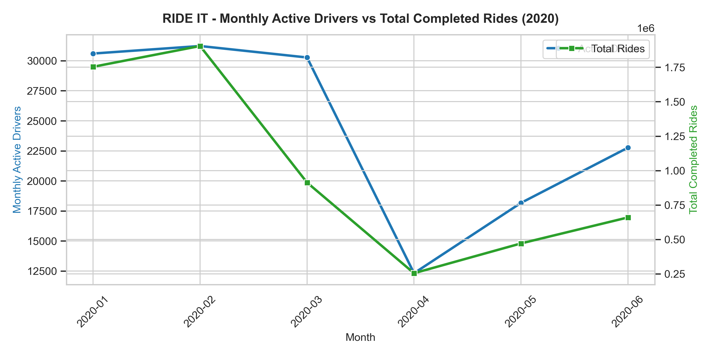
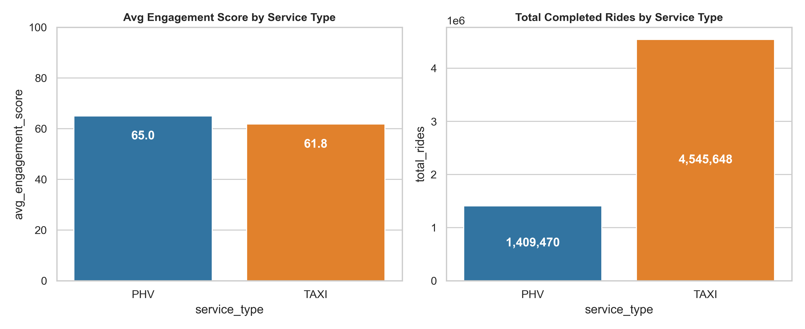
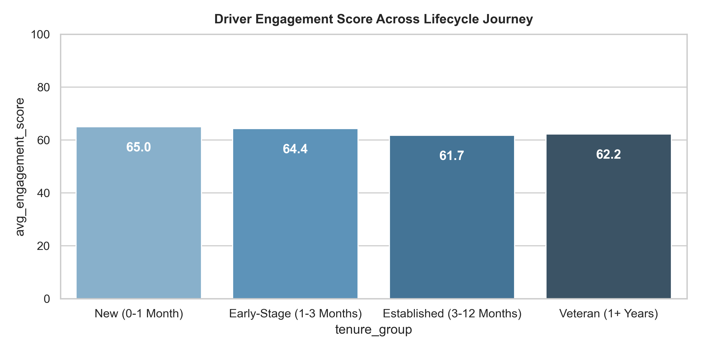
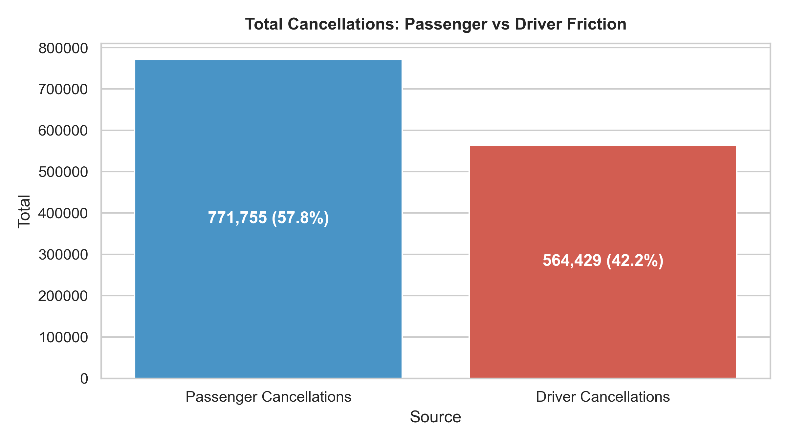

# 🚕 RIDE IT: Drivers Engagement & Lifecycle Analytics

[](https://www.python.org/)
[](https://www.mysql.com/)
[](https://powerbi.microsoft.com/)
[](LICENSE)

An end-to-end data analytics project exploring driver lifecycle, dispatch acceptance, cancellation friction, and retention drivers across European ride-hailing operations in **Germany (DE)** and **Spain (ES)** across 1.82M+ records.

---

## 📌 Project Overview

This project analyzes driver engagement and operational efficiency across licensed TAXI and Private Hire Vehicle (PHV) fleets. Using a full analytics pipeline (**Excel ➔ Python ➔ SQL ➔ Power BI ➔ PowerPoint**), we modeled driver performance, formulated a multi-factor composite engagement score, and diagnosed key operational bottlenecks.

### 🎯 Key Business Highlights
- **1.82M+ Activity Records & 36,972 Registered Drivers** analyzed across 2020.
- **50.1% Active Fleet Ratio** (18,540 average monthly active drivers).
- **Composite Engagement Score (0–100)**: Fleet mean score of **62.3 / 100**.
- **Onboarding Retention Finding**: A **7.6-point engagement dip** occurs between New (0–30 days: 66.5) and Early-Stage (31–90 days: 58.9) drivers.
- **Cancellation Breakdown**: 16.4% overall cancellation rate, with **61.2% passenger-initiated** vs. **38.8% driver-initiated**.

---

## 🏗️ Analytics Pipeline Architecture

```
CSV Source Data (36.9K Drivers | 1.82M Daily Activity Logs)
                      │
                      ▼
Excel (Schema Discovery & Data Profiling)
                      │
                      ▼
Python / Pandas / NumPy (Data Cleaning, Funnel Alignment & Feature Engineering)
                      │
                      ▼
MySQL Database (Schema DDL & 8 Business Analytics Queries)
                      │
                      ▼
Power BI (Star Schema Model, DAX Measures & 3-Page Interactive Dashboard)
                      │
                      ▼
Executive PowerPoint Deck (10-Slide Stakeholder Presentation)
```

---

## 📐 Engagement Score Methodology

The composite **Engagement Score (0–100)** balances conversion efficiency, responsiveness, and reliability:

$$\text{Score} = (0.35 \times \text{Completion Rate}) + (0.25 \times \text{Acceptance Rate}) + (0.25 \times \text{Daily Volume Scale}) + (0.15 \times \text{Reliability Index})$$

### Fleet Segmentation Tiers:
* 🟢 **High Engagement (70–100)**: $37.8\%$ of driver-days — Power drivers with $>90\%$ completion and strong consistency.
* 🔵 **Medium Engagement (40–69)**: $51.8\%$ of driver-days — Core operational backbone; prime target for upgrade incentives.
* 🔴 **Low Engagement (< 40)**: $10.4\%$ of driver-days — Drivers with high cancellation and low dispatch response rates.

---

## 📊 Visualizations & Output Artifacts

| Chart Preview | Focus Area |
| :--- | :--- |
|  | **Temporal Trend**: Monthly Active Drivers vs. Completed Rides |
|  | **Fleet Segment**: TAXI (11.8M rides) vs. PHV (1.9M rides) |
|  | **Driver Lifecycle**: Engagement across 4 Tenure Cohorts |
|  | **Cancellation Breakdown**: Passenger (61.2%) vs Driver (38.8%) |

---

## 📁 Repository Structure

```
.
├── data/
│   └── Rideit_drivers.csv                    # Driver master profiles (36,972 rows)
├── output/
│   ├── drivers_cleaned.csv                   # Validated driver profiles
│   ├── monthly_kpi_summary.csv               # Aggregated monthly performance table
│   ├── service_type_kpi_summary.csv          # Segment summary table
│   └── *.png                                 # High-resolution chart visuals (Charts 1-6)
├── powerbi/
│   ├── RIDE_IT_Interactive_Dashboard.html    # Standalone interactive 3-page web dashboard
│   ├── powerbi_dax_measures.dax              # Complete DAX measures library
│   └── powerbi_data_model_guide.md           # Star schema blueprint & layout specs
├── presentation/
│   ├── RIDE_IT_Driver_Engagement_Deck.pptx   # 10-slide executive presentation
│   └── slide_deck_notes_and_script.md        # Complete speaker script & notes
├── python/
│   ├── RIDE_IT_Drivers_Engagement_Analysis.ipynb # Jupyter notebook with end-to-end analysis
│   ├── run_data_pipeline.py                 # Automated data ETL & metric generation
│   └── generate_charts.py                   # Chart generation script
├── sql/
│   ├── 00_schema_and_import.sql             # Table creation & ingestion DDL
│   ├── 01_monthly_active_drivers.sql to 08_cancellation_segments.sql
│   └── all_business_queries.sql             # Consolidated SQL repository
└── README.md
```

---

## 🚀 How to Run the Project Locally

### 1. Clone the repository
```bash
git clone https://github.com/<your-username>/RIDE_IT_Drivers_Engagement_Analysis.git
cd RIDE_IT_Drivers_Engagement_Analysis
```

### 2. Set up Python Environment & Run ETL Pipeline
```bash
python -m venv venv
venv\Scripts\activate      # On Windows
pip install pandas numpy matplotlib seaborn python-pptx
python python/run_data_pipeline.py
python python/generate_charts.py
```

### 3. Open Interactive Dashboard
Simply double-click `powerbi/RIDE_IT_Interactive_Dashboard.html` or open it with any web browser (Chrome, Edge, Firefox).

---

## 💼 Resume Summary (For Recruiters)

* **Data Processing & Modeling:** Ingested and cleansed 1.82M+ operational activity records and 36.9K+ driver profiles across Germany & Spain; developed an optimized Star-Schema data model.
* **Feature Engineering & DAX:** Engineered core operational KPIs and a balanced 0–100 Composite Driver Engagement Score using Python and custom DAX measures.
* **Interactive 3-Page Dashboard:** Designed a multi-page dashboard tracking active drivers (50.1% active ratio), ride completion rates, and fleet segmentation (TAXI vs. PHV).
* **Business Insights:** Isolated key lifecycle bottlenecks (Day 31–90 onboarding drop-off) and quantified cancellation drivers (61% passenger vs. 39% driver) to recommend targeted retention initiatives.
